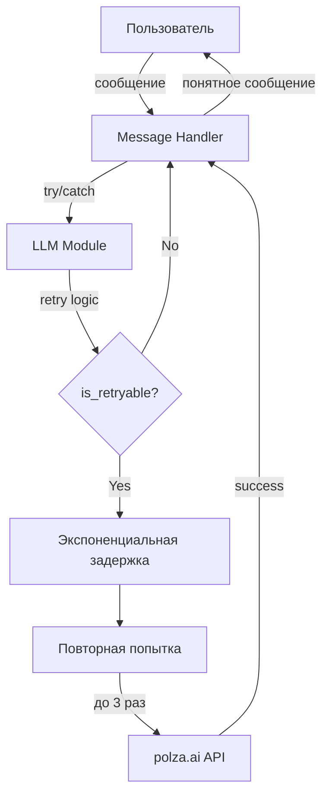

# Обработка ошибок LLM API

## Проблема

При работе с внешними LLM API (polza.ai) могут возникать временные ошибки:
- `Service is temporarily unavailable. All proxies failed after 20 retries`
- Timeout ошибки
- Rate limiting (429)
- Временная недоступность сервера (503)

## Решение

Реализована robust обработка ошибок с автоматическими повторными попытками (retry) и понятными сообщениями для пользователя.

### 1. Retry механизм в `src/ai/llm.py`

**Функция `is_retryable_error()`** определяет, можно ли повторить запрос:

- ✅ **Временные ошибки (retry):**
  - Timeout ошибки (asyncio.TimeoutError, httpx.TimeoutException)
  - Network ошибки (httpx.ConnectError)
  - Rate limiting (openai.RateLimitError)
  - Server errors 5xx (503, 500)
  - **polza.ai специфика**: BadRequestError (400) с текстом "temporarily unavailable" или "LLM_REQUEST_ERROR"

- ❌ **Постоянные ошибки (no retry):**
  - Authentication errors (401, 403)
  - Not found (404)
  - Invalid request (400 без временной недоступности)

**Функция `send_message()`** с retry логикой:

- Максимум 3 попытки по умолчанию
- Экспоненциальная задержка: 2 сек → 5 сек → 10 сек
- Timeout: 30 секунд (connect timeout: 5 секунд)
- Подробное логирование каждой попытки

### 2. Обработка ошибок в handlers

Все вызовы LLM обернуты в try/except с понятными сообщениями:

**`src/bot/handlers/messages.py`:**
- Storytelling (основной диалог)
- Writing finale (генерация финала)
- Откат сообщения пользователя при ошибке для возможности повтора

**`src/bot/handlers/commands.py`:**
- Bot starts story (бот начинает историю)
- Continue after completion choice (продолжение истории)

**`src/story/formatter.py`:**
- Graceful fallback при генерации названия/финального текста
- Graceful fallback при генерации похвалы

**Сообщения пользователю:**
- **Rate limit**: "⏰ Слишком много запросов. Подожди немного и попробуй снова."
- **Temporary unavailable**: "😔 Извини, сервис временно недоступен. Попробуй через минуту."
- **Other errors**: "Произошла ошибка. Попробуй позже или /help"

### 3. Конфигурация

Новые параметры в `src/config.py`:

```python
"llm_timeout": float(getenv("LLM_TIMEOUT", "30.0")),
"llm_max_retries": int(getenv("LLM_MAX_RETRIES", "3")),
"llm_retry_delay": float(getenv("LLM_RETRY_DELAY", "2.0")),
```

Можно настроить через `.env` файл:

```env
LLM_TIMEOUT=30.0
LLM_MAX_RETRIES=3
LLM_RETRY_DELAY=2.0
```

## Тестирование

Тесты в `test_error_handling_simple.py`:

```bash
uv run python test_error_handling_simple.py
```

Проверяется:
- ✅ Функция `is_retryable_error()` корректно определяет временные/постоянные ошибки
- ✅ Все модули импортируются без ошибок
- ✅ Новые конфигурационные параметры присутствуют

## Архитектура



## Преимущества

1. **Reliability**: Автоматическое восстановление при временных сбоях
2. **UX**: Понятные сообщения для пользователя вместо технических ошибок
3. **Data safety**: Сообщения пользователя сохраняются перед вызовом LLM
4. **Graceful degradation**: Formatter работает с fallback даже при полном отказе LLM
5. **Configurability**: Все параметры retry настраиваются через env vars

## Логирование

Все ошибки логируются с подробной информацией:
- Тип ошибки
- Номер попытки
- Время задержки
- ID пользователя и контекст

Пример:
```
2026-01-22 14:00:00 - src.ai.llm - ERROR - LLM Error (attempt 1/3): BadRequestError: Service is temporarily unavailable
2026-01-22 14:00:00 - src.ai.llm - INFO - Retrying after 2.0 seconds...
2026-01-22 14:00:03 - src.ai.llm - INFO - LLM Response: length=150 chars
```
